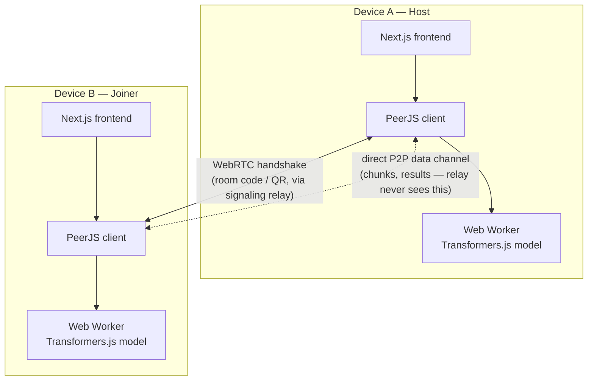

# Architecture

Two devices. One task. No middle server doing the thinking.

This document is the map underneath the pitch — what actually moves, where, and why it was built this way.

---

## The shape of it

The signaling relay exists for exactly one reason: two browsers can't find each other on the open internet without *some* introduction. It's a switchboard, not a listener. It sees a room code arrive, connects two sockets, and steps out of the conversation. Every byte of actual work — the document, the chunks, the summaries — moves only across the direct channel the two browsers open with each other.

---

## What happens, in order

**1. Chunking.** A document arrives and gets cut along sentence boundaries into as many pieces as there are devices in the room — host included. Lives in `lib/chunker.ts`.

**2. Distribution.** Each non-host chunk travels over that device's own P2P data channel. The host keeps its own slice local — no network hop for the piece it's already holding.

**3. Local inference.** Every device — independently, at the same time — runs `Xenova/distilbart-cnn-6-6` through [Transformers.js](https://huggingface.co/docs/transformers.js), inside a dedicated Web Worker (`lib/inference.worker.ts`), so the interface never freezes while the model thinks. Generation uses greedy decoding rather than beam search — a deliberate trade of marginal output polish for the difference between a two-minute demo and a ten-minute one on consumer hardware.

**4. Return.** Each device sends its result back over the same channel it received the chunk on.

**5. Convergence.** Once every device reports done, the host doesn't just display the pieces side by side. It concatenates them into one prompt and runs a final local inference pass (`lib/merge.ts`) — a real synthesis, not a stitched list wearing a summary's clothes.

---

## Local vs. cloud, stated plainly

| Component | Runs where | Sees your data? |
|---|---|---|
| Chunking | In-browser, client | — |
| Summarization | In-browser, client, per device | — |
| Convergence | In-browser, client, host device | — |
| Signaling relay | Self-hosted server | No — connection metadata only |
| App hosting | Static, Vercel | No backend logic at all |

---

## Decisions worth explaining

**Star topology, not mesh.** Every device connects directly to whoever starts a session, rather than connections propagating outward automatically. Simpler to reason about, simpler to secure, honest tradeoff for the timeline — documented, not hidden, in the README.

**Host approval on every connection.** A code or a QR scan starts a *request*. Nothing completes until the host says yes. The obvious alternative — anyone with the code just gets in — was rejected on purpose.

**Greedy decoding over beam search.** The first working version used the library's default beam search and took 5–10 minutes for a two-device run on a real document. Switching to greedy decoding brought that down to roughly two minutes for the same task. Chosen with eyes open: some ceiling on output polish, in exchange for a demo that doesn't test anyone's patience.

**Inference isolated in a Web Worker.** The model never touches the main thread — the interface, including the live connection map, stays responsive while real computation happens underneath it.
