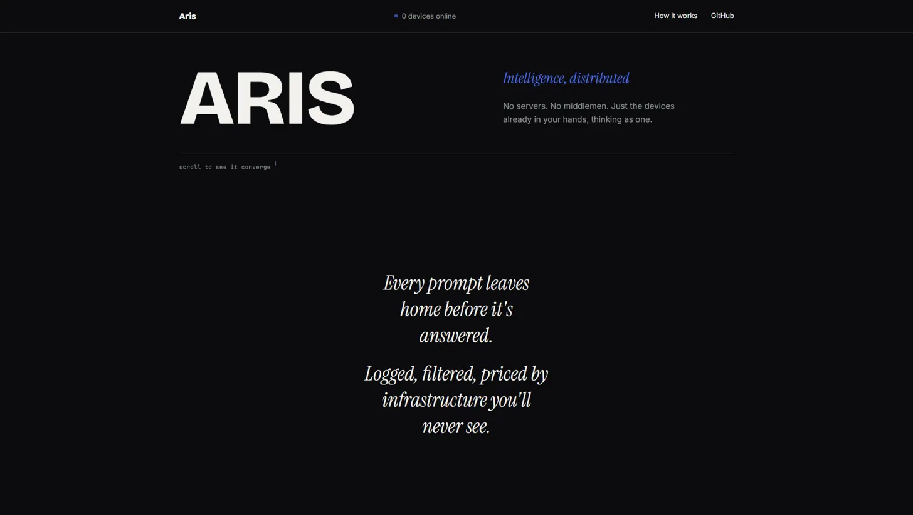
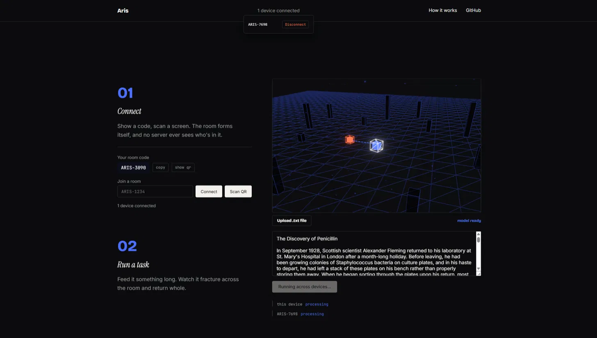
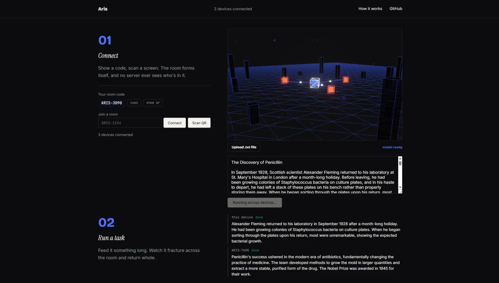
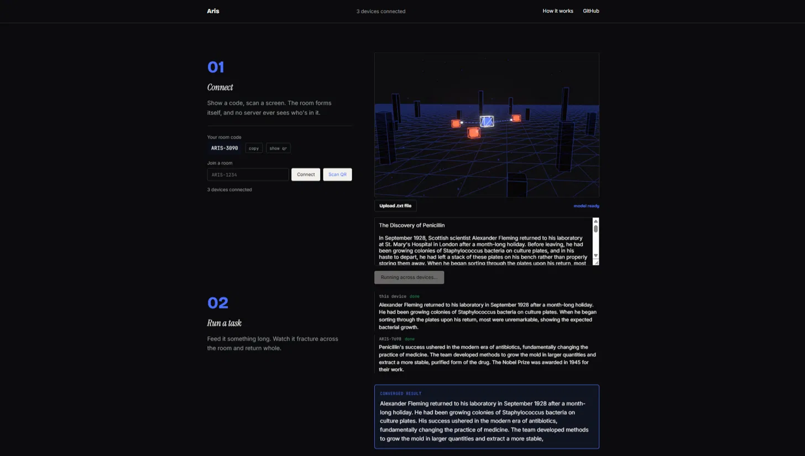

# Aris

Two devices. Same room. One AI.

No cloud. No account. No server that ever sees what you're working on.

**[aris-ai-ashen.vercel.app](https://aris-ai-ashen.vercel.app)**

---

### What just happened

You opened this on your laptop. You opened it on your phone. You showed one screen to the other, and now they're talking directly, device to device, no server between them.

Paste something long. Watch it split in half. Watch both devices think about their half at the same time, out loud, right there in the interface. Watch the two halves become one answer.

That's Aris. Everything past this line is just proof.

---

### Why this exists

Cloud AI has a supply chain. Your prompt leaves your device, crosses infrastructure you'll never audit, gets processed by a model you didn't choose, under terms you didn't read, and comes back changed by all of it.

"On-device AI" was supposed to be the answer. Mostly it's been a consolation prize — one phone, one model, working alone, no faster than before it went local.

Aris asks a different question: what if the fix wasn't running away from the network, but building a *better* one? One made of the devices already in the room.

### What it does, mechanically

A document walks in. It gets cut along sentence boundaries into as many pieces as there are connected devices. Each device — your laptop, someone's phone, whatever's in the room pulls its own piece and runs a real summarization model on it, locally, inside a Web Worker, in-browser. Not a call to an API pretending to be local. An actual model, actually running, on actual silicon you can point to.

When every piece comes back, one more local pass takes all the partial summaries and converges them into a single answer — not a list stapled together, an actual synthesis.

The only thing that ever touches a server is the handshake. Two browsers can't find each other on the open internet without *some* introduction — the same reason phone calls need an exchange, not because the exchange listens in. That's the entire job of the one small relay this project runs. It sees a room code. It never sees your document, your chunks, or your answer.

### What's real right now

- Peer-to-peer device discovery, PeerJS over WebRTC
- Every connection is host-approved — a code or a QR scan starts a *request*, not a connection
- Real parallel on-device inference, Transformers.js (`Xenova/distilbart-cnn-6-6`), isolated in a Web Worker per device
- A genuine convergence step — partial results get synthesized, not just displayed side by side
- A live 3D map of who's actually connected, drawn from real connection state, not decoration

### Built with

`Next.js 14` · `TypeScript` · `Transformers.js` · `PeerJS / WebRTC` · `Three.js + React Three Fiber` · `Framer Motion`
Relay: `Node` + `peer`, self-hosted, deployed separately from the app.

### Run it yourself

Two Node projects live here — the app at the root, the relay under `server/signaling`.

```bash
git clone https://github.com/bitbyrizbit/aris-ai.git
cd aris-ai && npm install
cd server/signaling && npm install && cd ../..
```

Start the relay:
```bash
cd server/signaling && npm start
```

Point the app at it — create `.env.local` in the root:
```text
NEXT_PUBLIC_PEER_HOST=localhost
NEXT_PUBLIC_PEER_PORT=9000
NEXT_PUBLIC_PEER_PATH=/aris
NEXT_PUBLIC_PEER_SECURE=false
```

Run it:
```bash
npm run dev
```

Open two tabs, or two real devices pointed at a deployed instance. Connect them. Watch it happen.

*One note: Transformers.js needs webpack, not Turbopack — already handled in the scripts (`next dev --webpack`, `next build --webpack`).*

### See it

Demo video: *[link before submission]*






### Where the edges are

Said plainly, not apologized for.

`.txt` and `.md` only — no PDF, no DOCX. The window went to the inference engine, not a file parser.

Summarization is the only task wired up. The pipeline — split, distribute, infer, and converge is built to carry transcription, translation, batch work. Only one of those exists today.

The network is a star, not a mesh. Whoever starts a task reaches the devices connected *to them*, not devices connected to their peers. Everyone joins one host.

A device that drops mid-task stalls the convergence step rather than working around it.

Feed the model a spreadsheet instead of prose and it'll confidently write nonsense - trained on news articles, not tables. That's the model's ceiling, not something the app can hide.

Host approval is the only gate. No identity layer sits behind it.

### License

MIT. [LICENSE](./LICENSE)

---

*Aris — from "aristos." Not the biggest model in the room. The most devices thinking as one in it.*